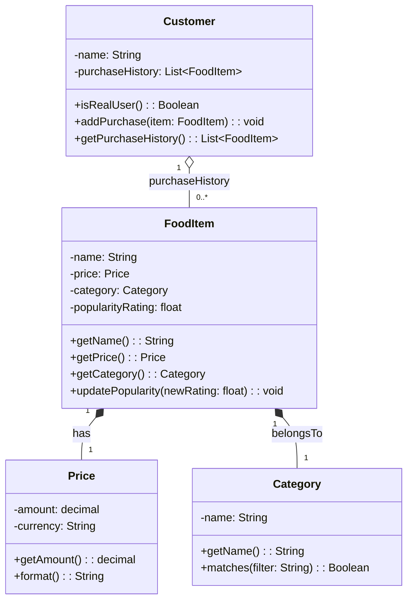

# Revised UML Diagram (ByteBites)

## Design Notes
- Diagram is intentionally limited to the four classes specified in `bytebites_spec.md`.
- `Customer` stores previous purchases to support user verification.
- `FoodItem` composes both `Price` and `Category`, reflecting required item metadata.
- Collection-management and transaction behavior are not modeled here because they would require additional classes beyond the requested four.
