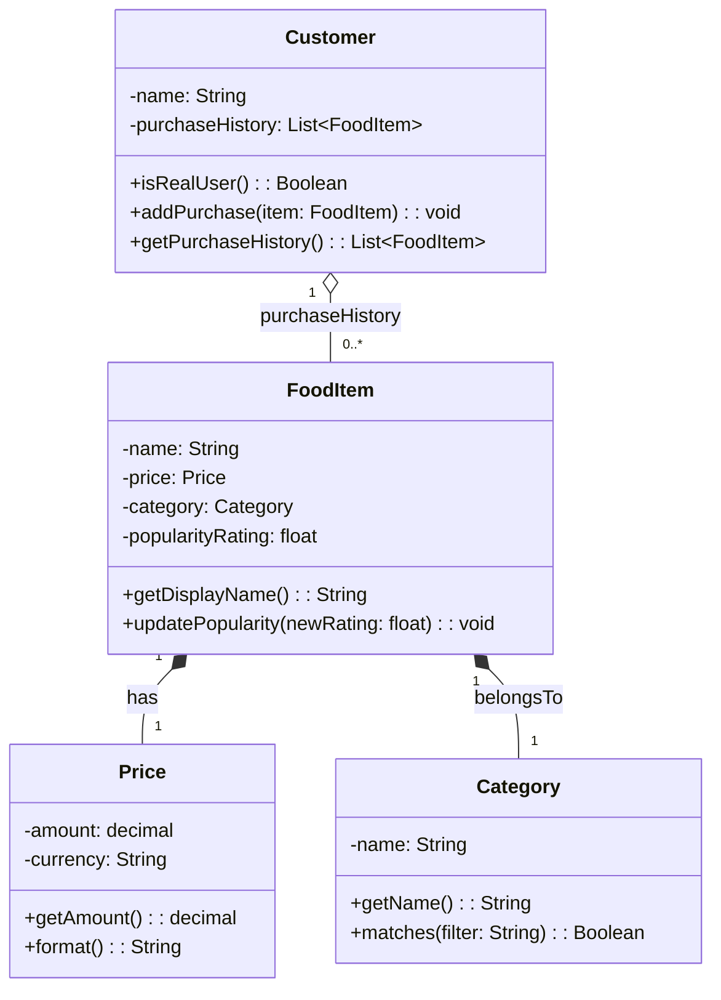

# UML-Style Class Diagram (Draft)

## Notes
- This draft only models the four classes explicitly listed in `Candidate Classes`.
- Additional domain objects mentioned in the request (like `ItemCollection` and `Transaction`) can be added in a next iteration.
